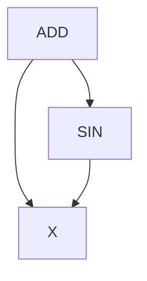

# radgrad

<p align="center">
  
</p>

----

**radgrad** (**rad** stands for reverse-mode automatic differentiation) is
an educational implementation of automatic differentiation on top
of a Numpy wrapper. It is a (very) simplified clone of
[Autograd](https://github.com/hips/autograd).

Here's a basic example:

```python
import radgrad.numpy_wrapper as np
from radgrad import grad

def tanh(x):
    return (np.exp(x) - np.exp(-x)) / (np.exp(x) + np.exp(-x))

print(tanh(1.0))
dtanh_dx = grad(tanh)
print(dtanh_dx(1.0))
```

`grad` is a higher-order function. It takes a function that contains
mathematical calculation that uses Numpy, and transforms it into a function
that computes the derivative of this computation. In the code above, the call
`tanh(1.0)` evaluates the value of the `tanh` function at `1.0`; the call
`dtanh_dx(1.0)` evaluates the derivative of the `tanh` function with respect
to its inputs at `1.0`.

To understand how `radgrad` works, start by reading
[this blog post](https://eli.thegreenplace.net/2025/reverse-mode-automatic-differentiation/).
Then, just read `radgrad`'s code and play with the examples. The code is
heavily commented to explain what's going on.

To make the learning journey easier, this project is split into two parts:

* [Part 1](https://github.com/eliben/radgrad/tree/main/part1-basic): implements
  the simplest AD mechanism possible, with support for only first order
  derivatives.
* [Part 2](https://github.com/eliben/radgrad/tree/main/part2-higher-order):
  builds on top of part 1 to implement higher-order derivatives.

The code of parts 1 and 2 is almost identical; I recommend starting with Part 1,
and once you understand how it works, run a recursive diff (e.g.
`meld part1-basic/ part2-higher-order/`) to get a feeling for the deltas. Read
more on higher-order derivatives in `radgrad` below.

## Tracing AD approach

`radgrad` implements _tracing_ AD; when `grad(f)` is invoked, there's no static
analysis of `f`'s code going on. Instead, `grad` wraps all the arguments passed
into `f` with special `Box` types that keep track of the operations performed
on them (using a mix of operator overloading and specially wrapped Numpy
primitives). This is used to construct an implicit computational graph
(_implicit_ in the sense that the user isn't even aware of it) on which the
[reverse mode AD process can be run](https://eli.thegreenplace.net/2025/reverse-mode-automatic-differentiation/).

This lets us calculate derivatives of code that contains Python control flow;
here's an example from `examples/taylor-sin.py`:

```python
from radgrad import grad
import math

def taylor_sin(x):
    ans = term = x
    for i in range(0, 20):
        term = -term * x * x / ((2 * i + 3) * (2 * i + 2))
        ans = ans + term
    return ans

dsin_dx = grad(taylor_sin)

for x in ["0.0", "math.pi / 4", "math.pi / 2", "math.pi"]:
    xname, xval = x, eval(x)
    print(f"sin({xname}) = {taylor_sin(xval):.3}")
    print(f"dsin_dx({xname}) = {dsin_dx(xval)[0]:.3}")
```

`taylor_sin` computes a Taylor series approximation to `sin`. Note how it
uses a Python loop; `grad(taylor_sin)` still works, even though it's not clear
what the derivative of a Python loop even means! In reality, the tracing
approach ensures that the loop is _unrolled_ in the computational graph - it
only sees the actual path taken by a specific invocation.

## Running the code

I find it easiest to run this code using `uv`. For example:

```shell
$ cd part1-basic
$ PYTHONPATH=. uv run examples/tanh.py
```

Some examples plot graphs using `matplotlib`. If you want to see the plots,
ask `uv` to include `matplotlib` in the dependencies, as follows:

```shell
$ cd part2-higher-order
$ PYTHONPATH=. uv run --with matplotlib examples/tanh.py
```

This produces a plot of several levels of derivatives of the `tanh` function:

<p align="center">
  
</p>

## Higher-order derivatives in Part 2

Some quick notes of how Part 2 works, and what's different from Part 1. The
key insight is that the derivative calculation is composed from the same
types of Python and Numpy operations that the original computation is composed
of; therefore, if we trace the derivative calculation, we can also find the
derivative of the derivative. The changes from Part 1 to Part 2 make this
possible, in two steps.

The easier step is making sure our VJP functions are defined in terms of
traced primitives rather than original Numpy primitives, e.g:

```python
add_vjp_rule(_np.sin, lambda x: (sin(x), lambda g: [cos(x) * g]))
```

Note that the gradient now uses `cos(x) * g` rather than `_np.cos(x) * g`.
`cos` is our wrapped primitive, so it supports tracing.

The more complicated step is ensuring that recursive invocations of `grad`
compose properly and don't interfere with each other, since there are multiple
levels of `Box`es involved[^1]. This is done by adding a `level` for each
box, with the level becoming automatically higher for every additional
derivative.

To understand how this works, consider this simple example first, assuming
Part 1:

```python
import radgrad.numpy_wrapper as np
from radgrad import grad1

def f(x):
    return x + np.sin(x)

df_dx = grad1(f)
print(df_dx(0.5))
```

What happens when `df_dx(0.5)` is invoked?

A `Box` is created for `0.5`; this box has an empty node with no predecessors,
since it's an argument ("root" node). Then `f` is called with the `Box` as the
argument. Python evaluates the expression inside `f`.

It starts with `np.sin(x)`, which calls our wrapped `sin` primitive. Since `x`
is already a box, there's no need to box it again. The VJP rule for `sin` is
invoked, calculates the actual value `np.sin(0.5)` and returns a derivative
function that will calculate `np.cos(0.5) * g` when called with `g`. Finally,
the output is `Box`ed with a `Node` that has the argument `x` as the
predecessor.

The overloaded `+` operates similarly, and we end up with something like the
following computational graph built out of `Node`s (the arrows point to
predecessor nodes):




[^1]: Part 2 also adds a `grad1` helper - it just wraps `grad` to return a
single derivative instead of a list; this results in nicer code when we want to
compute higher-order derivatives of functions with a single argument, e.g.
`d3y = grad1(grad1(grad1(tanh)))(x)`.

